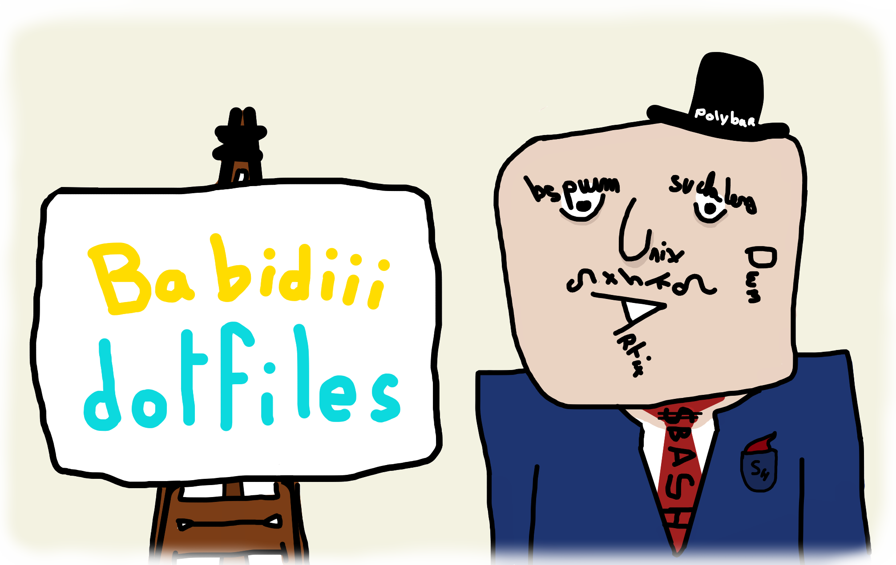
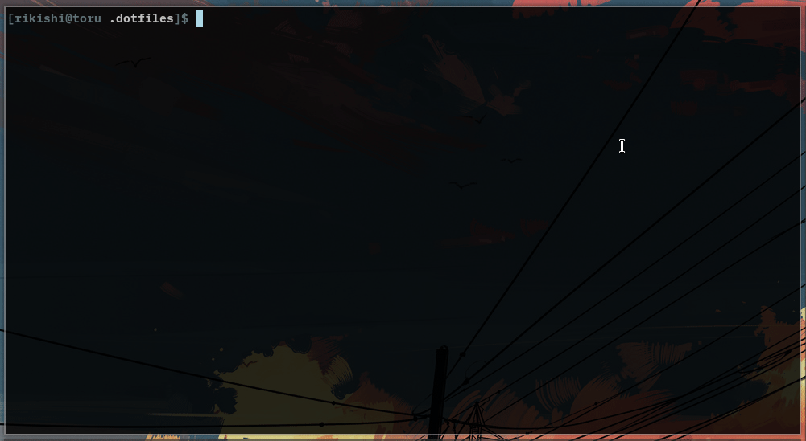
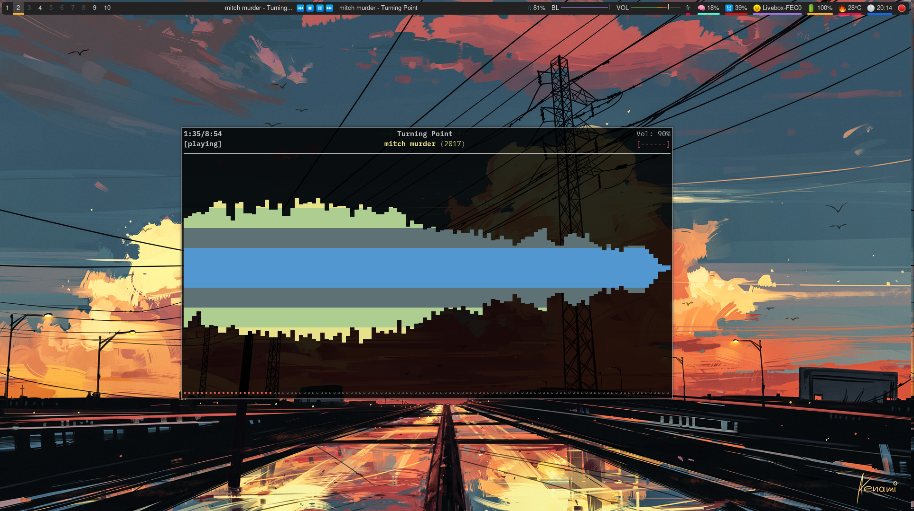
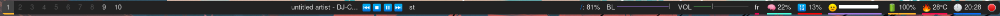
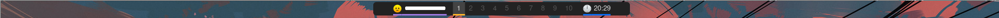

# .dotfiles

- vim/nvim
- tmux
- polybar
- bspwm
- dwm
- dmenu
- readline
- dunst
- sxiv

readline

 

ncmpcpp

 

  

Polybar

 

main monitor:  
  
second monitor:  
  

sxiv

 

| key bindings | description                      | Require             |
|--------------|----------------------------------|---------------------|
| `C-x`        | copy filename into the clipboard | `xclip`             |
| `C-c`        | Copy image into the clipboard    | `xclip`             |
| `C-g`        | Open into gimp                   | `st, exiv2`         |
| `C-comma`    | Rotate 270                       | `jpegtran, mogrify` |
| `C-period`   | Rotate 90                        | `jpegtran, mogrify` |
| `C-slash`    | Rotate 180                       | `jpegtran, mogrify` |
| `C-k`        | Send the file using croc         | `croc, whiptail`    |
| `C-d`        | Dmenu popup for deletion         | `dmenu`             |
| `C-s`        | Set as background                | `setbg`             |

Demo for wallpaper and croc shortcut: 

  

